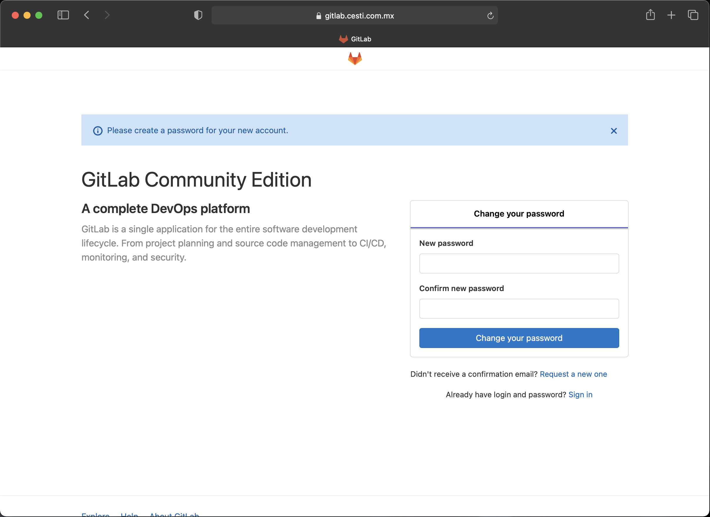
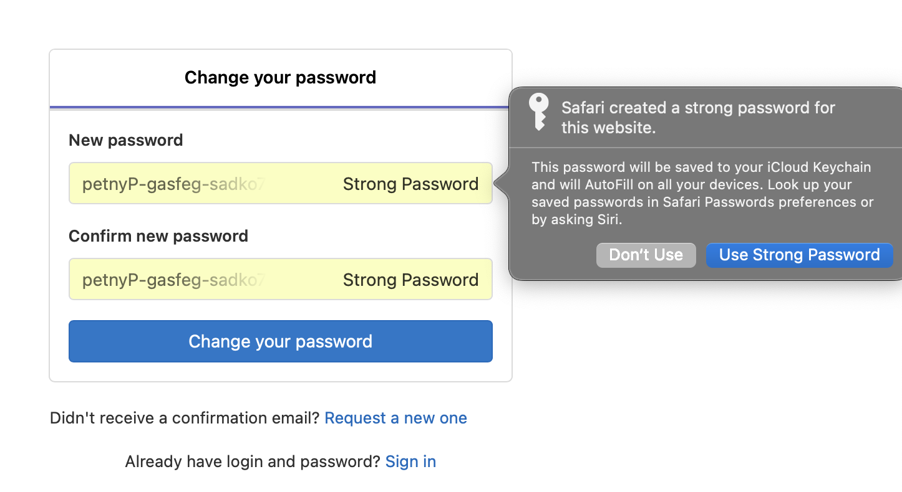
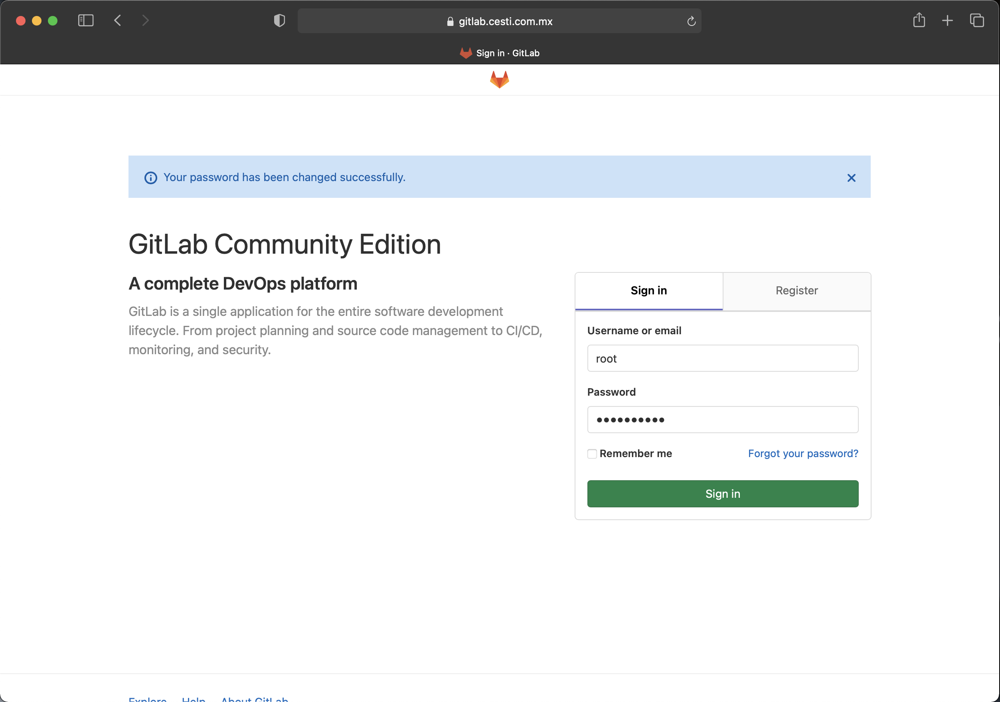
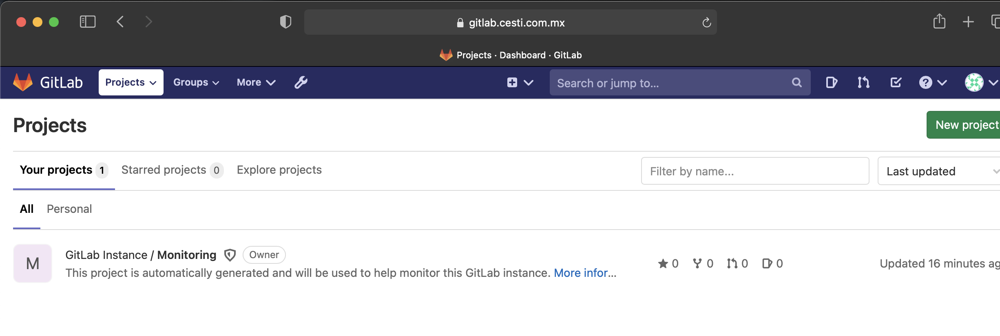

# Instalar Gitlab en CentOS / RedHat 8

## Prerequisitos de instalación

* Servidor físico o virtual con:
    * Sistema Operativo CentOS/ReHat 8
    * 4 Gb de memoria RAM
    * 4 cores
    * 60 Gb de almacenamiento
* Un nombre de dominio para el certificado SSL
* Buzón de correo de Gsuite (de preferencia del mismo dominio)
* Conexión SSH al servidor
* Usuario con permisos de sudo o root
* Git instalado

**Nota**. Para este ejercicio, estamos considerando los requerimientos mínimos de instalación, por lo que esto nos estaría dando una capacidad de soportar por lo menos 500 usuarios, si se requiere de mas capacidad referirse a la siguiente url [Referencia de Arquitectura](https://docs.gitlab.com/ee/administration/reference_architectures/)

## Instrucciones de Instalación

##### Descargar el repositorio y cambiarse al directorio del mismo

```bash
[user@gitlab ]# git clone https://github.com/isaalop/gitlab.git
```

```bash
[user@gitlab gitlab]# cd gitlab
```

##### Dar permisos de ejecución al archivo install.sh con el siguiente comando:

```bash
[user@gitlab gitlab]# chmod 755 instalador.sh
```

##### Modificar el archivo "VALORES" con los datos correspondientes a su instalación con su editor preferido

```bash
[user@gitlab gitlab]# cat VALORES
URL=    # Nombre del dominio con el que se configurará el serviciod de Gitlab
EMAIL=  # Usuario de correo electrónico de Gsuite
PASSWORD=   # Contraseña de aplicación del usuario de gsuite
DOMINIO=    # Nombre del dominio de Gsuite
```

```bash
EJEMPLO:

URL=gitlab.midominio.com    # Nombre del dominio con el que se configurará el serviciod de Gitlab
EMAIL=miusuario@midominio.com  # Usuario de correo electrónico de Gsuite
PASSWORD=DFGUIOKVLER4234CDW87R4   # Contraseña de aplicación del usuario de gsuite
DOMINIO=midominio.com    # Nombre del dominio de Gsuite
```

##### Una vez que esten listos los valores, ejecutar el script de instalación

```bash
[root@gitlab gitlab_install]# ./instalador.sh
```

## Ingreso al servicio

##### Ingresar a la url https://gitlab.midominio.com y realizar el cambio de contraseña para el usuario root

<center></center>&nbsp;

Elegir una contraseña fuerte y guardarla en un almacén de contraseñas

<center></center>&nbsp;

Ahora ya podemos ingresar al servicio con nuestro usuario root y la contraseña definida anteriormente

<center></center>&nbsp;

Listo, ya tenemos arriba y operando nuestro servicio de Gitlab

<center></center>&nbsp;